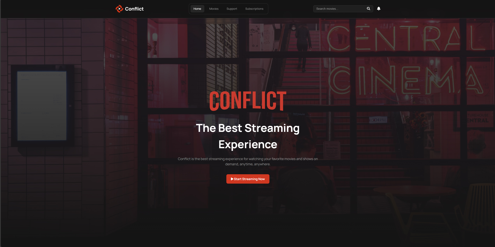
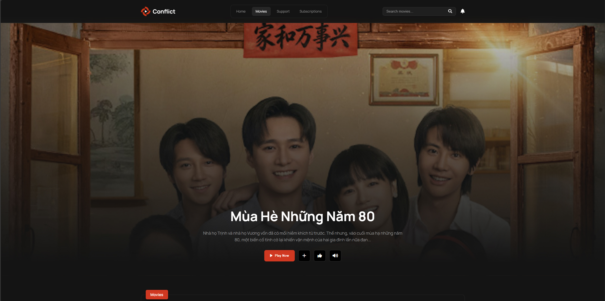
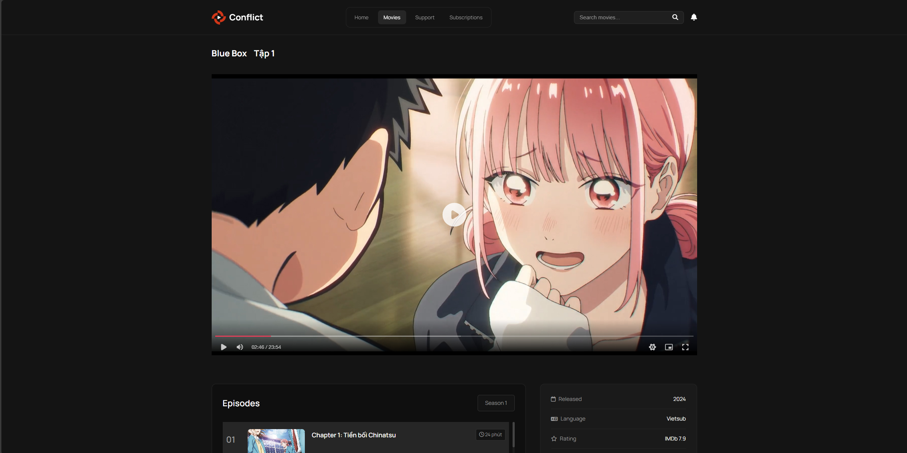
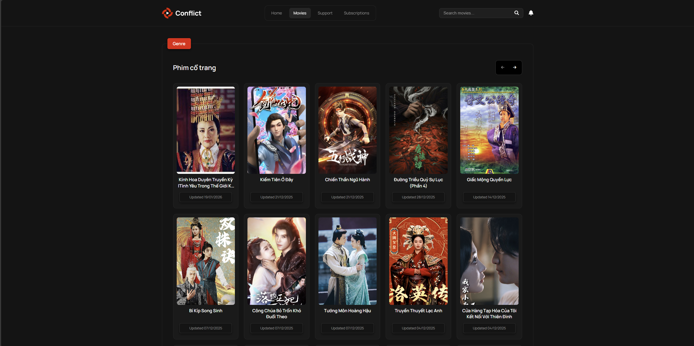
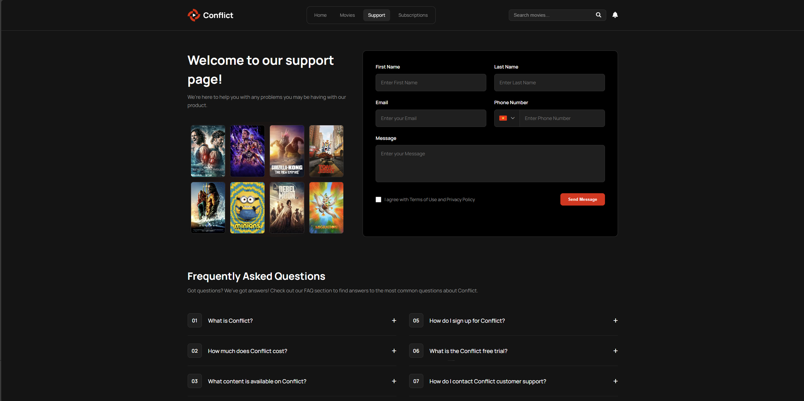
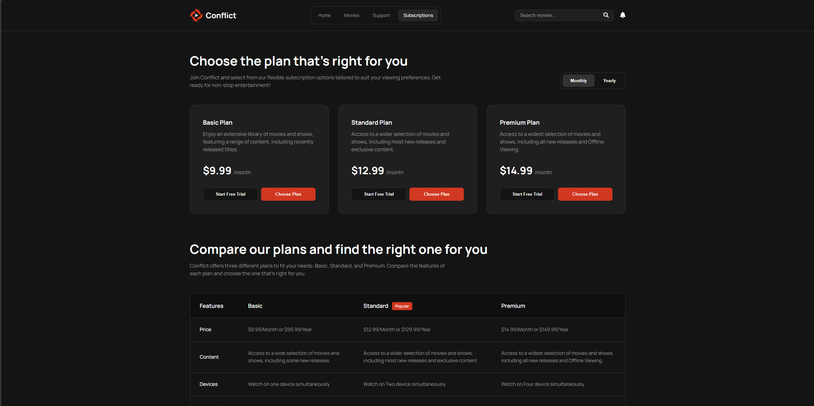
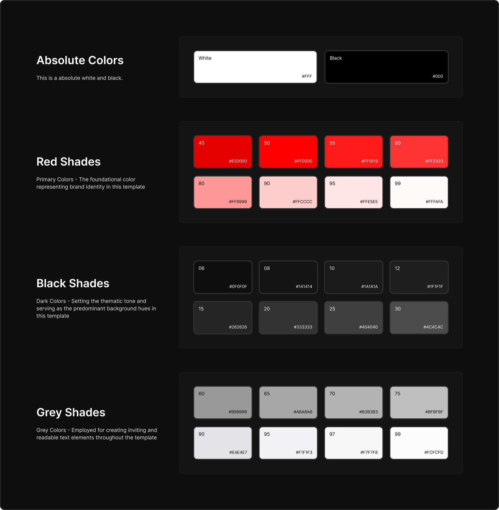
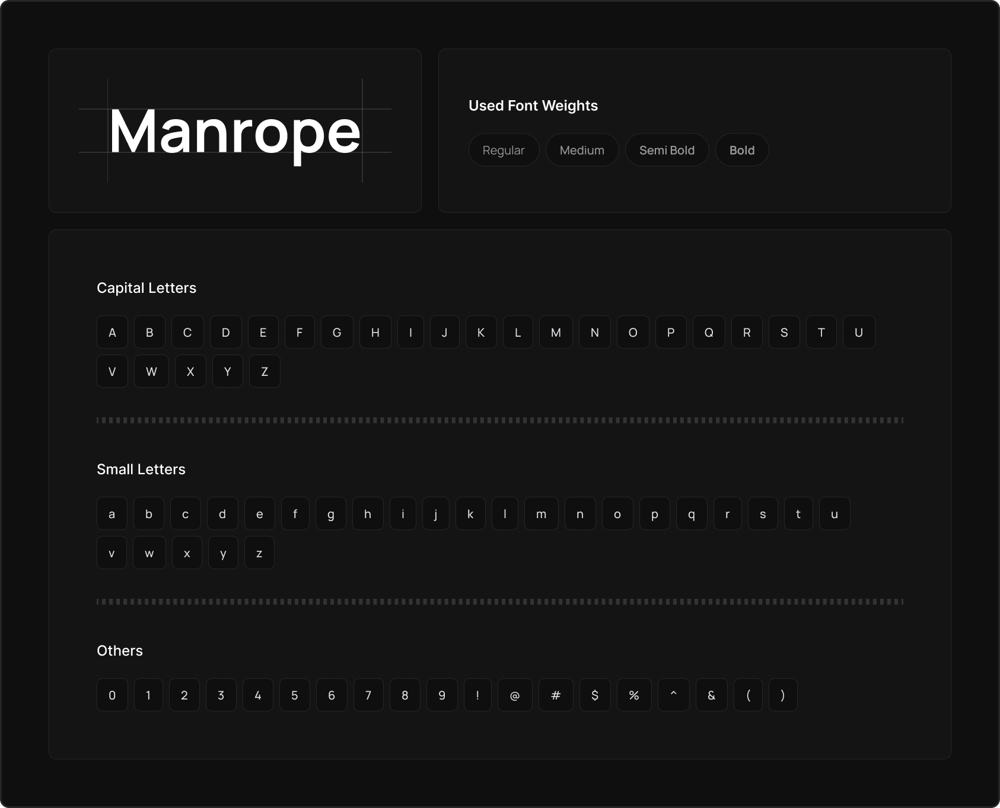

# 🎬 Web Xem Phim (Conflict) - BTL Web 2025


> Dự án website xem phim trực tuyến được xây dựng bằng HTML, CSS và JavaScript thuần. Website hỗ trợ giao diện Responsive trên nhiều thiết bị.

## 🔗 Demo
👉 **Trải nghiệm ngay tại:** https://nguyenvietdoanh0502.github.io/BTL_Web_2025/pages/Home_page/index.html

---

## 📸 Hình ảnh demo
**Trang chủ**


**Trang phim**


**Trang xem phim**


**Trang thể loại phim**


**Trang hỗ trợ**


**Trang đăng ký thành viên**



---

## ✨ Tính năng chính

* **Trang chủ (Home):** Hiển thị các thể loại phim, thiết bị tương thích, gói thành viên.
* **Phim (Movie):** Hiển thị các phim nổi bật, phim mới cập nhật,..
* **Phân loại (Genres):** Lọc phim theo thể loại (Hành động, Tình cảm, Hoạt hình...).
* **Xem phim (Watch):** Trình phát video mượt mà. Xem thông tin diễn viên, tóm tắt nội dung, đánh giá.
* **Responsive:** Tương thích tốt với PC, Tablet và Mobile.
* **Khác:** Trang đăng ký gói (Subscription), trang hỗ trợ (Support).

---

## 🛠️ Công nghệ sử dụng

* **Frontend:** HTML5, CSS3 (Flexbox, Grid, CSS Variables), JavaScript (ES6+).
* **Design:** Figma: Thiết kế theo phong cách hiện đại, tối màu (Dark mode default).
* **Icon:** FontAwesome 6.
* **Font:** Manrope (Google Fonts).

---

## 🎨 Thiết kế
**Color Style:**



**Typography:**



---

## 🚀 Cài đặt và chạy trên máy (Local)

Để chạy dự án này trên máy tính của bạn:

1.  **Clone dự án về máy:**
    ```bash
    git clone https://github.com/nguyenvietdoanh0502/BTL_Web_2025.git
    ```

2.  **Mở thư mục dự án:**
    Vào thư mục vừa clone bằng VS Code.

3.  **Chạy dự án:**
    * Cài đặt Extension **Live Server** trong VS Code.
    * Chuột phải vào file `pages/Home_page/index.html` -> Chọn **Open with Live Server**.

---

## 📂 Cấu trúc thư mục
```
├── 📁 asset
├── 📁 pages
│   ├── 📁 Error_page
│   │   ├── 🌐 index.html
│   │   ├── 📄 index.js
│   │   ├── 🎨 responsive.css
│   │   └── 🎨 style.css
│   ├── 📁 Genres_page
│   │   ├── 🌐 index.html
│   │   ├── 📄 index.js
│   │   ├── 🎨 responsive.css
│   │   └── 🎨 style.css
│   ├── 📁 Home_page
│   │   ├── 🌐 index.html
│   │   ├── 📄 index.js
│   │   ├── 🎨 responsive.css
│   │   └── 🎨 style.css
│   ├── 📁 Movie_page
│   │   ├── 🌐 index.html
│   │   ├── 📄 index.js
│   │   ├── 🎨 responsive.css
│   │   └── 🎨 style.css
│   ├── 📁 Sub
│   │   ├── 🌐 index.html
│   │   ├── 📄 index.js
│   │   ├── 🎨 responsive.css
│   │   └── 🎨 style.css
│   ├── 📁 Support_page
│   │   ├── 🌐 index.html
│   │   ├── 📄 index.js
│   │   ├── 🎨 responsive.css
│   │   └── 🎨 style.css
│   └── 📁 Watch_movie_page
│       ├── 🌐 index.html
│       ├── 📄 index.js
│       ├── 🎨 responsive.css
│       └── 🎨 style.css
├── 📝 README.md
├── 🌐 index.html
├── 📄 index.js
├── 🎨 main.css
└── 🎨 responsive.css
```